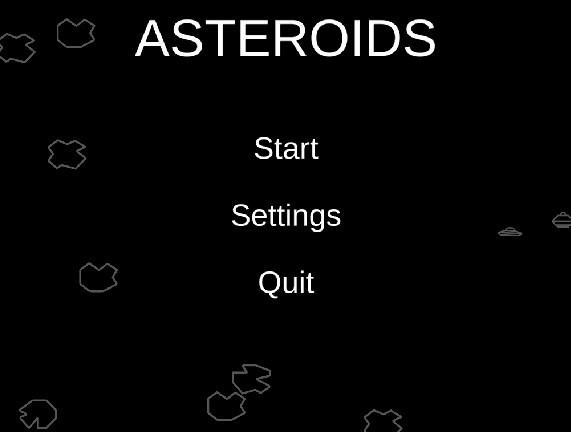
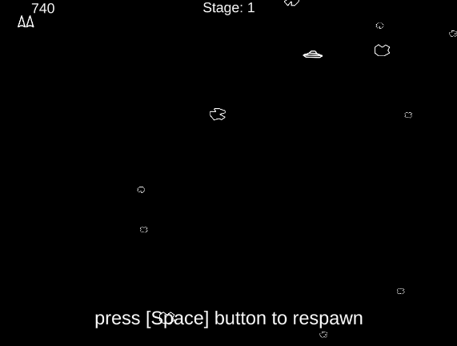

# Asteroids Arcade
Вольный клон Asteroids Arcade от Atari (текущий билд под Windows).
https://en.wikipedia.org/wiki/Asteroids_(video_game)

### Демонстрация геймплея
Играть в браузере (с компьютера):  https://vareera.itch.io/asteroids-test  
Пароль для доступа: TestGame

## Реализованный функционал

Корабль игрока:
- Базовые механики: cтрельба, передвижение, смерть при столкновении
- Hyperspace (телепортация в случайное место с шансом появиться внутри астероида)

Противники:
- Большая тарелка (движется в одном случайно заданом направлении, неточно стреляет)
- Маленькая тарелка (быстро движется, точнее стреляет, умеет уклоняться от препятствий)

Геймплей:
- Возможность возрождения после смерти при наличии жизней
- Завершение уровня и переход на следующий при уничтожении всех противников
- Поражение при отсутствии жизней
- Добавление бонусной жизни при достижении определенного количества очков

UI:
- Отображение полученных очков, количество жизней и текущего уровня
- Надписи "уровень зачищен", "игра окончена", "нажмите клавишу для возрождения" в соотвествующие моменты игрового процесса
- Главное меню (кнопки: "Старт", "Настройки", "Выход")
- Меню паузы (кнопки: "Продолжить", "Настройки" и "В главное меню". Также в меню присутствует таблица с информацией об очках)
- Меню настроек (изменение громкости звука)

Звук:
- Движение корабля, звуки выстрелов игрока и тарелок. Звуки разрушений (астероидов, взрывы корабля игрока и терелок).

## Настройки

Все настройки находятся в отдельных scriptable object объектах (компоненты игровых сущностей ссылаются на них), благодаря этому можно изменять баланс игры непосредственно во время геймплея.

Существующие настройки:
- Клавиши
- Уровни
- Тарелки
- Астероиды 
- Получаемые очки

### Клавиши по умолчанию
| __Действие__ | __Клавиша__ |
|--------------|--------------------------|
| Движение вперед |W|
| Поворот влево  |A|
| Поворот вправо |D| 
| Выстрел |Space| 
| HyperSpace |Shift| 
| Меню / назад | Esc|

## Структура проекта
При создании игры был использован компонентный подход - каждая функция находится в отдельном компоненте (движение корабля, стрельба тарелки, поведение астероидов, разрушаемость и т.д.).

Главный класс ответственный за игровой процесс - GameCore (в сцене прикреплен к камере). 

## Дальнейшие планы

Многие аспекты игры можно улучшить и избавиться от багов, однако скорее всего проект будет оставлен в более-менее текущем виде т.к. не стоит дальнейших затрат времени.
